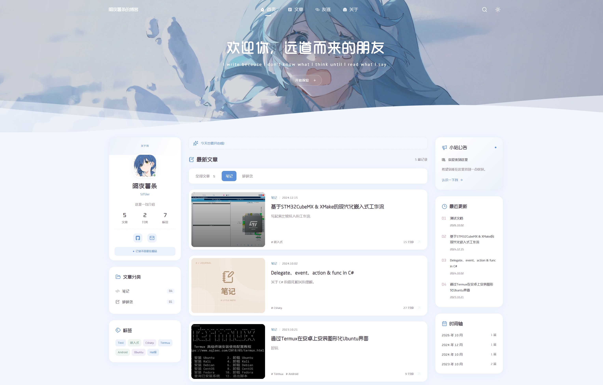

<div align="center">

# Lrinaus · Kanade-Astro

一个记录代码、灵感与日常的个人博客。

基于 Astro、Vue、Tailwind CSS 和 Kanade 主题构建；文章内容由 Markdown 内容集合管理，并通过 GitHub Actions 定时从飞书知识库同步。Vercel 负责监听 GitHub 仓库并自动部署最新版本。

[在线博客](https://lisii.cn) · [Astro 文档](https://docs.astro.build/) · [Vercel 文档](https://vercel.com/docs)

</div>


## 项目概览

这个项目是一个静态 Astro 博客。文章使用 Markdown 编写，Astro 在构建阶段读取 `src/content/posts/` 中的文章并生成静态 HTML。网站不依赖数据库。

当前内容同步链路如下：

```text
飞书知识库
    ↓
feishu-pages
    ↓
生成 dist/docs 和 dist/docs/assets
    ↓
normalize.mjs 整理文章、分类、Frontmatter 和图片
    ↓
复制到 src/content/posts 和 public/assets
    ↓
GitHub Actions 提交更新
    ↓
Vercel 检测 GitHub 提交并自动部署
```

## 环境

| 技术 | 用途 |
| --- | --- |
| Astro 7 | 静态页面生成、路由和内容集合 |
| Vue 3 | 搜索、筛选、导航和留言墙等交互组件 |
| Tailwind CSS 4 | 样式系统与响应式布局 |
| TypeScript 5 | 类型检查和开发约束 |
| Iconify | 页面图标 |
| Playwright | 浏览器自动化测试 |
| `feishu-pages` | 从飞书知识库读取文档 |
| `js-yaml` | 解析和生成 Markdown Frontmatter |
| pnpm 10 | 依赖管理 |
| Vercel | 生产环境自动构建和部署 |

当前 Node.js 要求：

```text
Node.js >= 22.12.0
pnpm = 10.33.0
```

## 本地开发

### 安装依赖

```bash
pnpm install --frozen-lockfile
```

### 启动开发服务器

```bash
pnpm dev
```

默认访问地址：

```text
http://localhost:4321
```

### 常用命令

| 命令 | 作用 |
| --- | --- |
| `pnpm dev` | 启动 Astro 开发服务器 |
| `pnpm check` | 检查 Astro、Vue 和 TypeScript 类型 |
| `pnpm build` | 构建生产站点到 `dist/` |
| `pnpm preview` | 预览已经构建好的站点 |
| `pnpm test` | 运行 Playwright 浏览器测试 |
| `pnpm run sync` | 拉取飞书知识库并更新文章和图片 |
| `pnpm run export` | 只运行 `feishu-pages` 导出 |
| `pnpm run normalize` | 只运行导出结果整理脚本 |
| `pnpm deploy:local` | Windows 下在后台启动生产预览 |

 `package.json` 中飞书同步脚本如下：

```json
{
  "scripts": {
    "export": "feishu-pages",
    "normalize": "node scripts/normalize.mjs",
    "sync": "pnpm run export && pnpm run normalize"
  }
}
```


## 文章 Frontmatter

一篇手动维护的文章可以这样写：

```markdown
---
title: "Delegate、event、action & func in C#"
date: "2024-10-02"
description: "关于 C# 的委托相关的理解。"
tags:
  - Csharp
category: "笔记"
cover: "notes"
image: "/assets/delegate-csharp.jpeg"
featured: false
draft: false
---

## 正文标题

这里开始写文章正文。
```

字段说明：

| 字段 | 必填 | 说明 |
| --- | --- | --- |
| `title` | 是 | 文章标题 |
| `date` | 是 | 发布日期，`YYYY-MM-DD` |
| `description` | 是 | 文章摘要，用于首页、列表、SEO 和 Open Graph |
| `tags` | 是 | 标签，例如 `['Csharp', '编程']` |
| `category` | 是 | 当前支持 `笔记` 和 `碎碎念` |
| `cover` | 是 | 默认封面图标类型 |
| `image` | 否 | 文章封面图片 URL，通常使用 `/assets/xxx.png` |

当前支持的 `cover` 值：

```text
notes
casual
```

注意：`cover` 是默认图标类型，`image` 是真实封面图片。两者用途不同：

```text
有 image  → 优先显示 image
没有 image → 根据 cover 显示默认图标
```

如果新增文章分类，需要同时检查并修改：

```text
src/content.config.ts
src/lib/posts.ts
src/components/posts/PostFeed.vue
```


## 文章封面与图片

飞书同步时，`normalize.mjs` 会自动读取正文中的第一张图片，然后自动加入：

```yaml
image: /assets/example.jpeg
```

如果正文中没有图片，则不会写入 `image` 字段，主题会回退到 `cover` 对应的默认图标。

同步脚本会把 Feishu 导出的图片从：

```text
dist/docs/assets/
```

复制到：

```text
public/assets/
```

`public/assets/` 是 Feishu 图片同步专用目录。当前脚本每次同步前会清空目标目录，再复制当前导出的全部图片，因此不要在其中保存需要手动维护的图片。

### 页面和样式

| 文件或目录 | 用途 |
| --- | --- |
| `src/pages/` | 首页、文章页、友链、关于、留言、RSS、站点地图等路由 |
| `src/components/` | 页面组件和交互组件 |
| `src/layouts/` | 全局布局和文章布局 |
| `src/lib/posts.ts` | 文章读取、摘要、分类、标签和归档逻辑 |
| `src/styles/global.css` | 字体、颜色、卡片、间距、主题和响应式样式 |
| `public/images/` | 头像、首屏插画等站点固定图片 |
| `public/assets/` | 文章图片，主要由 Feishu 同步生成 |


## 飞书知识库同步

### 1. 知识库结构

当前约定：

```text
首页
笔记
└── Delegate、event、action & func in C#
碎碎念
```

处理规则：

| 飞书节点 | 同步结果 |
| --- | --- |
| `首页` | 完全排除 |
| 一级节点，例如 `笔记` | 写入文章 `category` |
| 一级节点下的直接子节点 | 生成真正文章 |
| 一级分类自身 | 不生成 `笔记.md` 或 `碎碎念.md` |
| 一级分类下的 `封面` 节点 | 不作为文章处理 |

### 2. 飞书文章元数据

每篇飞书文章的最顶部放置一个 YAML 代码块。飞书编辑器中选择“代码块”，语言选择 `YAML`：

```yaml
slug: delegate-event-action-func-csharp
date: "2024-10-02"
description: 关于 C# 的委托相关的理解。
tags:
  - Csharp
cover: notes
```

`title` 不需要写，默认使用飞书知识库节点标题。

这些字段会被同步脚本读取：

```text
date
description
tags
cover
```

其中：

- 有 `date` 时使用文章填写的日期；
- 没有 `date` 时使用 Feishu 节点创建时间；
- 有 `description` 时使用手动摘要；
- 没有 `description` 时使用正文第一段；
- `tags` 没有自动推断，建议手动填写；
- `cover` 没有填写时，主题使用默认处理；
- 正文第一张图片会自动成为 `image`。

首页如果需要额外标记，可以在顶部 YAML 中写：

```yaml
hide: true
```

### 3. 同步脚本

脚本scripts/normalize.mjs负责：

1. 读取 `dist/docs.json`；
2. 找出一级分类和分类下的直接子文章；
3. 删除首页和分类 Markdown；
4. 整理文章 Frontmatter；
5. 设置 `category`；
6. 使用 Feishu 创建时间作为日期兜底；
7. 使用正文第一段作为 description 兜底；
8. 使用正文第一张图片作为 `image`；
9. 清空并更新 `src/content/posts/`；
10. 清空并更新 `public/assets/`；
11. 重新生成 `SUMMARY.md`。

脚本每次同步会清空以下两个目录：

```text
src/content/posts/
public/assets/
```

## GitHub Actions 自动同步

GitHub Actions 只负责拉取飞书内容和提交文章，不负责构建或部署网站。Vercel 负责监听 GitHub 提交并自动部署，因此同步流程是：

```text
GitHub Actions
    ↓
更新 src/content/posts 和 public/assets
    ↓
git commit + git push
    ↓
Vercel 自动构建和部署
```

工作流文件：

```text
.github/workflows/sync-feishu.yml
```

### 修改同步频率

例如每天香港时间凌晨 3:17：

```yaml
schedule:
  - cron: '17 3 * * *'
    timezone: 'Asia/Hong_Kong'
```

每 6 小时同步一次：

```yaml
schedule:
  - cron: '17 */6 * * *'
    timezone: 'Asia/Hong_Kong'
```

定时工作流可能存在延迟；修改后的工作流必须进入默认分支，定时任务才会按默认分支中的版本执行。


## 许可证与致谢

项目使用的 Astro、Vue、Tailwind CSS、Iconify、Playwright 和其他依赖遵循各自的开源许可证。

感谢[Kanade](https://github.com/sudoriaa/Kanade-Astro/tree/codex/astro-theme)提供了这么好看的主题。

